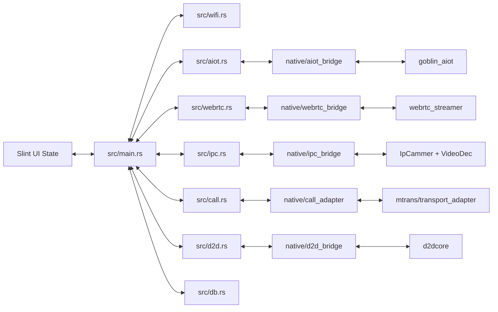

# KR_ROOM 配置与集成点

本文整理当前项目的配置来源、关键状态、Rust/Slint 回调和 Native 集成点，便于继续开发或排障。

## 入口文件

| 层级 | 文件 | 作用 |
| --- | --- | --- |
| App 入口 | `src/main.rs` | 创建 UI、读取配置、绑定所有回调、调度事件 |
| Slint 根组件 | `ui/app.slint` | 根据 `State.current-page` 切换页面和覆盖层 |
| 全局状态 | `ui/shared.slint` | 定义页面状态、业务状态、回调和 I18n |
| 交互说明 | `work.md` | 页面跳转、弹窗、键盘、按钮效果的依据 |
| 构建脚本 | `build.rs` | Slint 编译、Native bridge 编译与链接 |

## 重要 Slint 状态

### 页面与覆盖层

| 状态 | 含义 |
| --- | --- |
| `current-page` | 当前页面 Node ID |
| `previous-page` | 返回时使用的来源页面 |
| `active-overlay` | 当前弹窗、键盘或覆盖层 ID |
| `pressed-effect` | 按键效果 ID |
| `call-effect-locked` | 呼叫页按钮效果是否锁定 |
| `absent-mode-active` | 外出模式黑屏蒙版 |

### WiFi

| 状态 | 含义 |
| --- | --- |
| `wifi-enabled` | WiFi 开关 |
| `wifi-scan-ssids` | 扫描到的 SSID 列表 |
| `wifi-scan-open-flags` | SSID 是否开放网络 |
| `wifi-status` | `idle` / `scanning` / `connecting` / `connected` / `failed` |
| `wifi-connecting-ssid` | 正在连接的 SSID |
| `connected-ssid` | 已连接 SSID |
| `wifi-ipv4` | 当前 IPv4 |
| `wifi-dialog-locked` | 连接过程中锁定对话框 |

### 呼叫

| 状态 | 含义 |
| --- | --- |
| `call-session-state` | `idle` / `ringing` / `video_only` / `active` / `monitor` |
| `call-peer-id` | 对端 ID 或云端 peer label |
| `call-video-active` | 视频是否激活 |
| `call-audio-active` | 音频是否激活 |
| `call-last-error` | 最近错误 |
| `incoming-call-page` | 本地来电默认显示页面 |

### CCTV 与截图记录

| 状态 | 含义 |
| --- | --- |
| `cctv-camera-options` | 可选摄像头名称列表 |
| `cctv-selected-camera` | 当前选择的摄像头，1-based；0 表示默认第一台 |
| `cctv-current-camera-label` | 当前摄像头展示名 |
| `cctv-monitor-online` | 监视流是否 ready |
| `cctv-last-error` | CCTV 错误 |
| `cctv-last-capture-path` | 最近截图路径 |
| `capture-record-*` | 截图列表分页、图片、文本、未读、选中状态 |
| `capture-full-*` | 大图页图片、文本、位置、上一张/下一张状态 |

## 关键回调绑定

| Slint 回调 | Rust 绑定位置 | 当前行为 |
| --- | --- | --- |
| `refresh-wifi` | `bind_wifi_callbacks` | 触发 WiFi 扫描 |
| `wifi-set-enabled(bool)` | `bind_wifi_callbacks` | 开关 WiFi，并保存设置 |
| `connect-wifi(ssid, password)` | `bind_wifi_callbacks` | 发起 WiFi 连接 |
| `call-start(target)` | `configure_call_action_routing` | 发起云端 AIOT CallX 呼叫 |
| `call-accept()` | `configure_call_action_routing` | 优先接听云端呼叫，否则接听本地 Call |
| `call-reject()` | `configure_call_action_routing` | 优先拒绝云端呼叫，否则拒绝本地 Call |
| `call-hangup()` | `configure_call_action_routing` | 优先挂断云端呼叫，否则挂断本地 Call |
| `call-open-door()` | `configure_d2d_bindings` | D2D 默认门开锁 |
| `cctv-open()` | `configure_ipc_bindings` | 异步启动当前摄像头监视 |
| `cctv-select-camera(int)` | `configure_ipc_bindings` | 选择摄像头，CCTV 页内立即切流 |
| `cctv-stop()` | `configure_ipc_bindings` | 异步停止 IPC 监视 |
| `cctv-capture()` | `configure_ipc_bindings` | 生成截图路径并调用 IPC 截图 |
| `capture-records-*` | `capture_records::configure_capture_record_bindings` | 列表刷新、打开、选择、删除、翻页 |
| `save-*-setting` | `configure_database_bindings` | 保存设置到 SQLite |
| `float-setting-live-changed` | `configure_media_setting_routing` | 实时调整呼叫音量或 CCTV 亮度 |
| `set-system-time` | `configure_database_bindings` | 调用 `clock_settime` 设置系统时间 |
| `change-password` | `configure_d2d_bindings` | 校验旧密码后通过 D2D 设置新密码 |
| `refresh-system-info` | `system_info::configure_system_info_bindings` | 刷新系统信息 |

## 配置来源

目标平台上，配置主要来自 SQLite `settings` 表。数据库路径规则：

```mermaid
flowchart TD
    A[启动] --> B{KR_ROOM_DB_PATH 非空?}
    B -->|是| C[使用 KR_ROOM_DB_PATH]
    B -->|否| D{/data 存在?}
    D -->|是| E[/data/kr_room/kr_room.db]
    D -->|否| F[项目根目录 kr_room.db]
```

非目标平台多数后端使用默认配置和 stub bridge。

## 关键配置项

### AIOT

| Key | 用途 |
| --- | --- |
| `aiot.enabled` | 是否启用 AIOT |
| `aiot.interface` | 网络接口，默认 `wlan0` |
| `aiot.model` | 设备型号，启动必需 |
| `aiot.server_addr` | 平台地址，启动必需 |
| `aiot.mqtt_server_addr` | MQTT 地址，空时回退 `server_addr` |
| `aiot.keepalive` | keepalive 秒数 |
| `aiot.is_mqtts` | 是否使用 MQTTS |

### WebRTC

| Key | 用途 |
| --- | --- |
| `webrtc.enabled` | 是否启用 WebRTC runtime |
| `webrtc.interface` | 网络接口 |
| `webrtc.server_addr` | 初始服务器地址；AIOT 下发账号后会覆盖 |
| `webrtc.serno` | 初始序列号；空时可用 MAC 派生 |
| `webrtc.initstring` | 初始化字符串；AIOT 下发账号后会覆盖 |
| `webrtc.playback_device` | 播放设备 |
| `webrtc.record_device` | 录音设备 |
| `webrtc.enable_audio_input` | 是否启用音频输入 |
| `webrtc.enable_audio_output` | 是否启用音频输出 |

### IPC

| Key | 用途 |
| --- | --- |
| `ipc.enabled` | 是否启用 IPC |
| `ipc.interface` | 网络接口 |
| `ipc.preview_x/y/width/height` | 本地预览区域 |
| `ipc.capture_dir` | 截图目录 |
| `ipc.cameraN.enabled` | 第 N 台摄像头启用状态 |
| `ipc.cameraN.name` | 展示名 |
| `ipc.cameraN.ip` | 摄像头 IP，可用于 ONVIF/连接 |
| `ipc.cameraN.user` | 用户名 |
| `ipc.cameraN.password` | 密码 |
| `ipc.cameraN.rtsp_url` | 主码流 RTSP |
| `ipc.cameraN.sub_rtsp_url` | 子码流 RTSP |
| `ipc.cameraN.prefer_substream` | 是否优先子码流 |

### 本地 Call

| Key | 用途 |
| --- | --- |
| `call.enabled` | 是否启用本地 Call |
| `call.role` | 当前固定按 indoor 处理 |
| `call.self_id` | 本机 ID |
| `call.upstream_id` | 上游 ID |
| `call.ctrl_port` | 控制端口 |
| `call.interface` | 网络接口，默认 `eth0` |

### D2D

| Key | 用途 |
| --- | --- |
| `d2d.enabled` | 是否启用 D2D |
| `d2d.interface` | 网络接口，默认 `eth0` |
| `d2d.plc_port` | PLC 端口 |
| `d2d.f1_plc_addr` | F1 PLC 地址 |
| `d2d.indoor_plc_addr` | 室内机 PLC 地址 |
| `d2d.eth_port` | 以太网端口 |
| `d2d.indoor_id` | 室内机 ID |
| `d2d.default_door_id` | 默认门 ID |

### UI 设置

常见保存 key 包括：

- `network.wifi_enabled`
- `network.connected_ssid`
- `site.building_number`
- `site.room_number`
- `sound.door_call_melody`
- `sound.guard_call_melody`
- `mode.absent_timeout_min`
- `mode.communication_timeout_min`
- `mode.door_open_duration_sec`
- `security.door_unlock_password_plain`
- `security.door_unlock_password_hash`

## Native 集成边界



## 常用构建命令

目标平台 release 构建：

```bash
cargo build --target riscv64gc-unknown-linux-gnu --release
```

宿主机开发构建：

```bash
cargo build
```

宿主机通常走 stub 后端，适合检查 UI 编译和 Rust 逻辑，不验证真实设备链路。

## 排障入口

| 问题 | 优先查看 |
| --- | --- |
| UI 页面跳转/弹窗不对 | `work.md`、`ui/app.slint`、对应 `ui/*.slint` |
| 全局状态或回调不对 | `ui/shared.slint`、`src/main.rs` |
| WiFi 连接问题 | `src/wifi.rs`、`bind_wifi_callbacks` |
| AIOT 登录/事件问题 | `src/aiot.rs`、`configure_aiot_bindings` |
| 云端 WebRTC 呼叫问题 | `src/webrtc.rs`、`CloudCallController` |
| CCTV 监视/截图问题 | `src/ipc.rs`、`configure_ipc_bindings`、`native/ipc_bridge` |
| 截图列表问题 | `src/capture_records.rs` |
| 本地 Call 崩溃 | `native/call_adapter/kr_call_adapter.c`，搜索 `kr_call video:` |
| 开锁/密码修改问题 | `src/d2d.rs`、`configure_d2d_bindings` |
| 链接库选择问题 | `build.rs` |
