# KR_ROOM 功能执行流程

本文使用 Mermaid 描述当前项目的主要执行流程。入口逻辑集中在 `src/main.rs`，UI 状态集中在 `ui/shared.slint`。

## 应用启动总流程

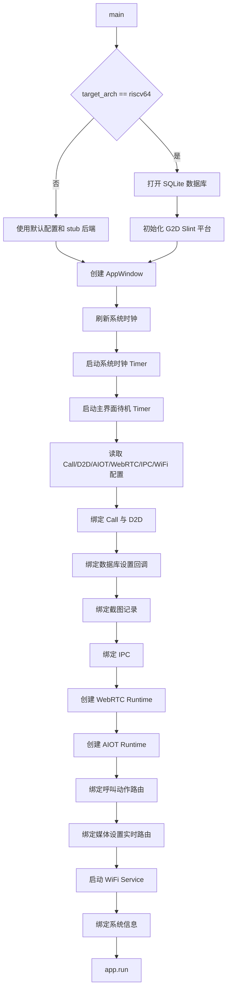

## 页面导航流程

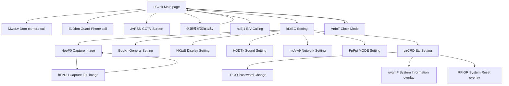

## 主界面待机时钟流程

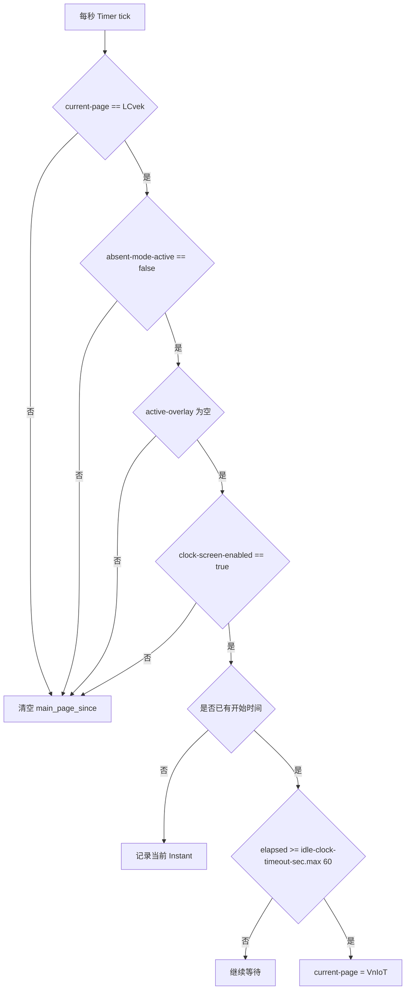

## WiFi 连接与平台懒启动流程

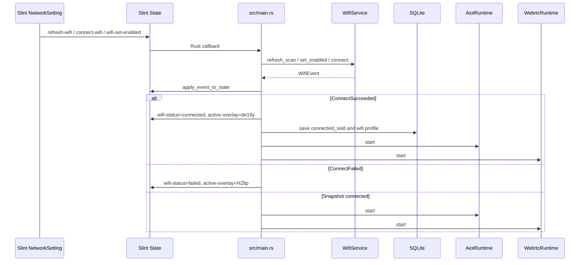

## AIOT 与 WebRTC 账号流程

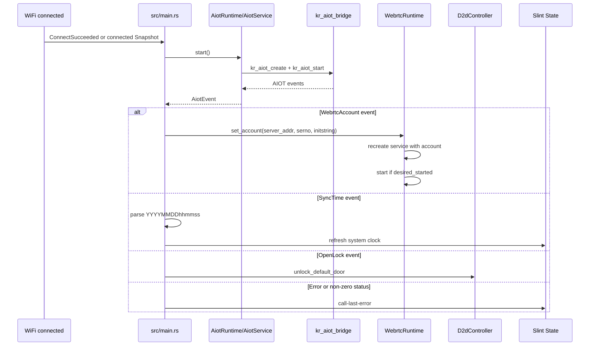

## 云端 CallX + WebRTC 呼叫流程

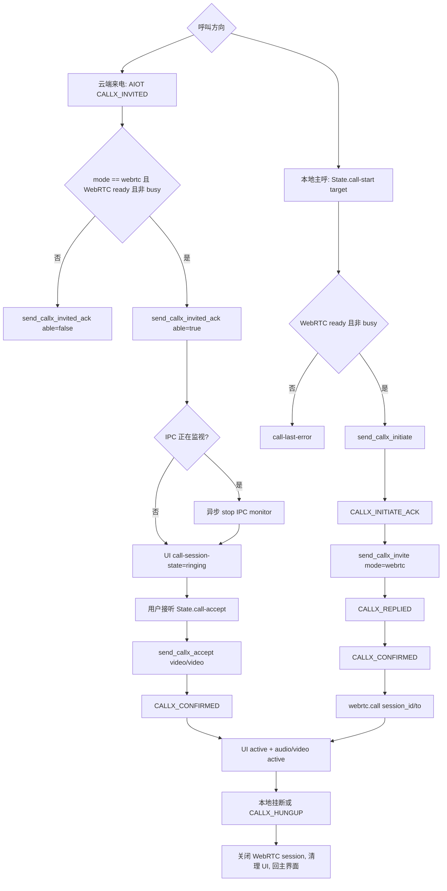

## 本地 Call 事件流程

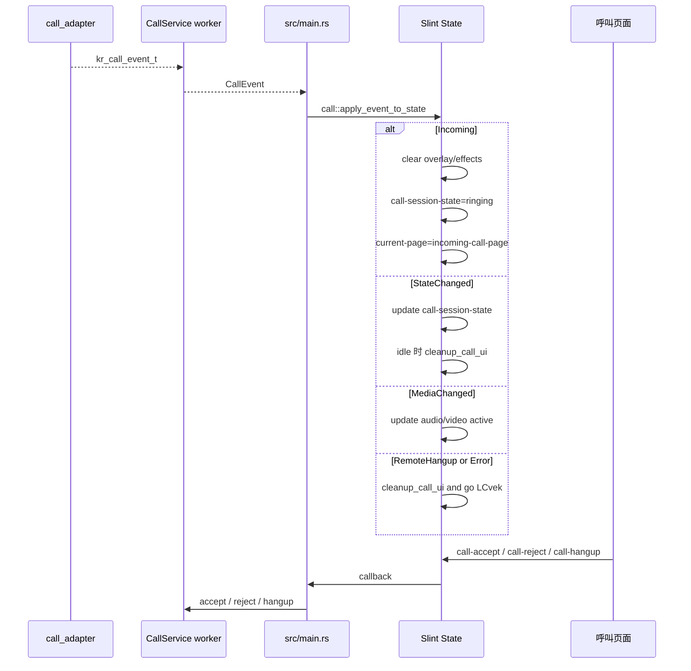

## D2D 开锁与密码修改流程

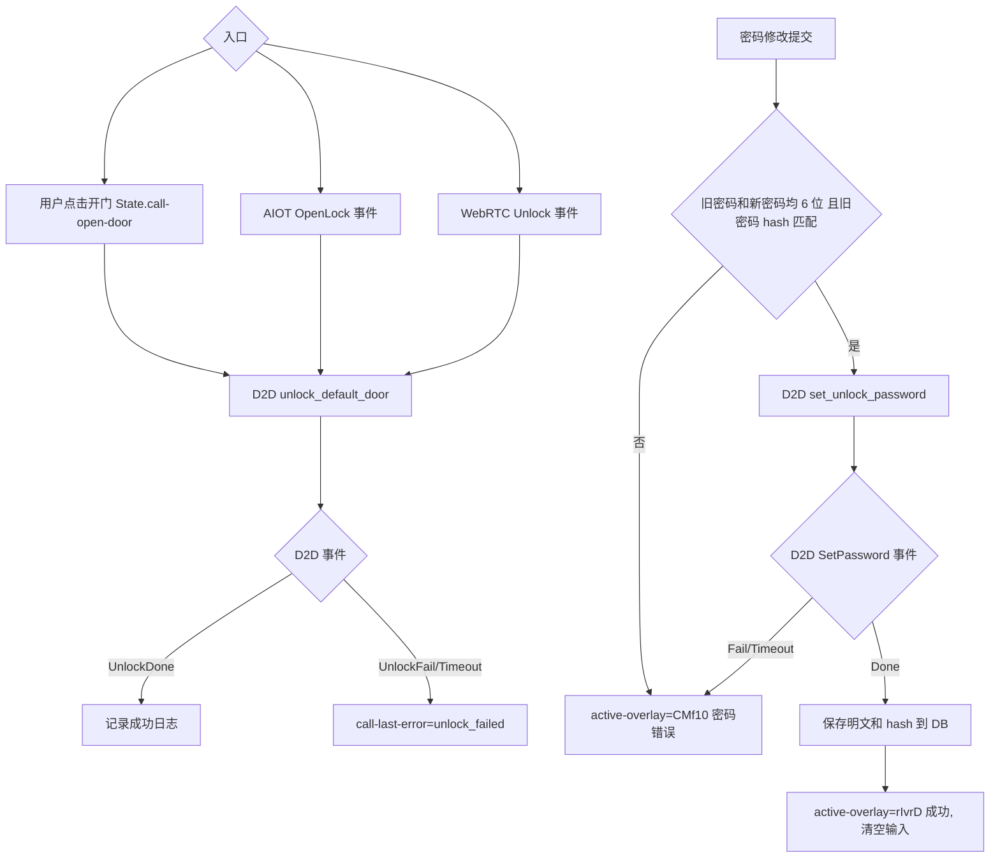

## IPC CCTV 监视与截图流程

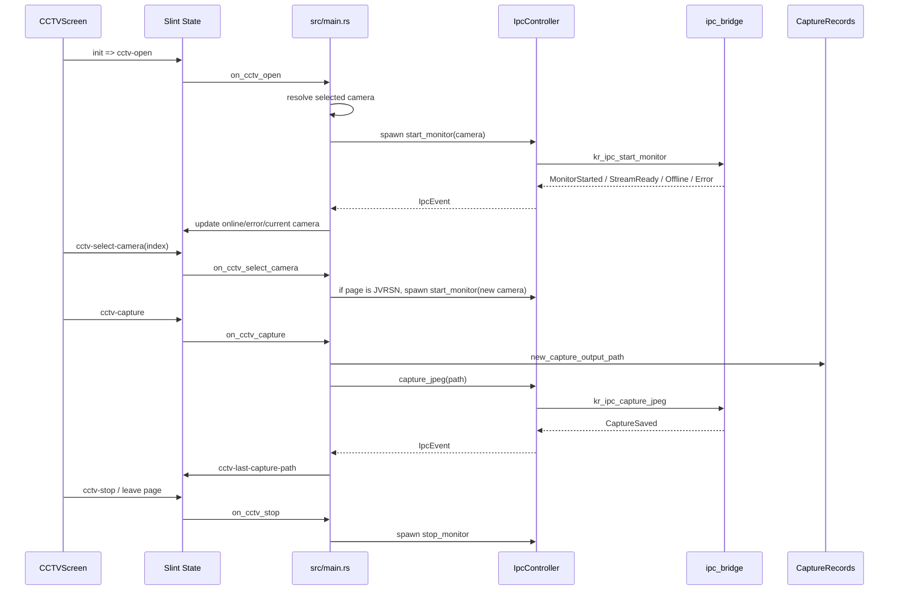

## 截图记录流程

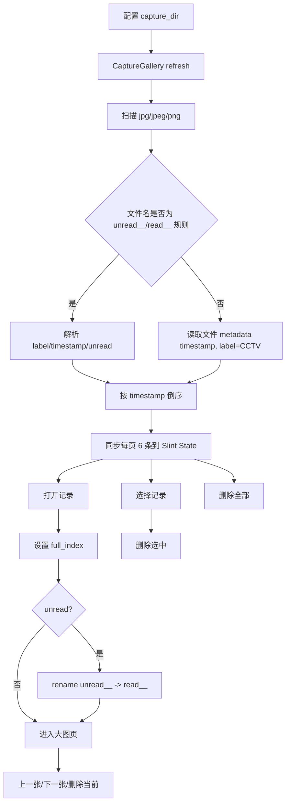

## 设置保存流程

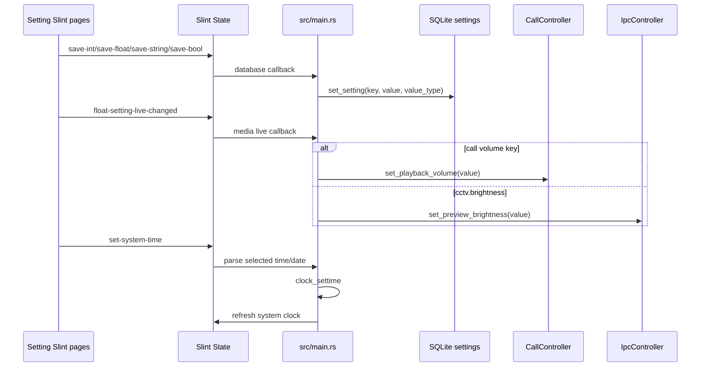

## 构建后端选择流程

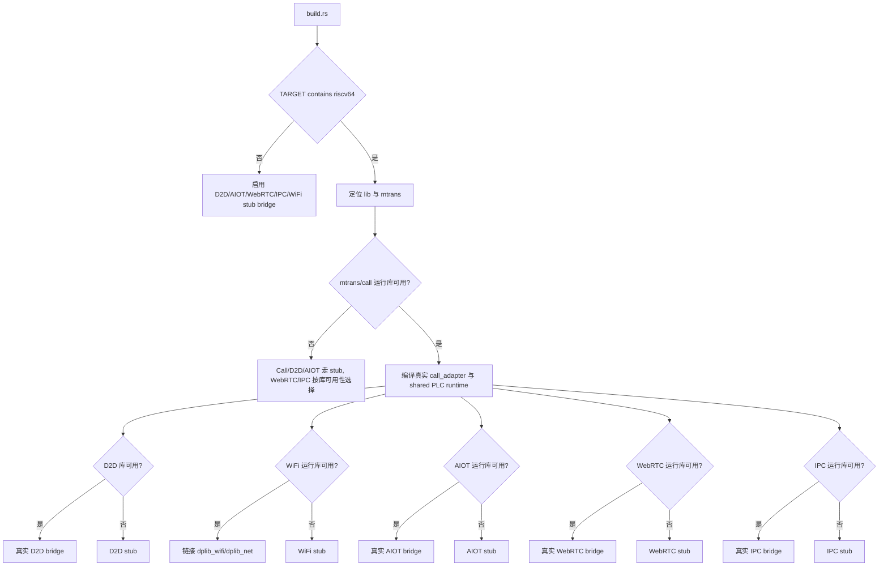
